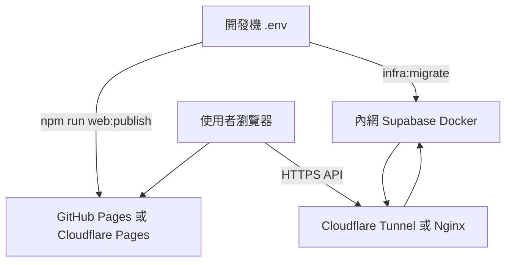

# 公開網域 + 內網私有資料庫

本 repo 採 **靜態前端 + Supabase HTTPS API** 架構。Postgres 留在公司內網，瀏覽器只連 API 子網域。

## 目錄

| 路徑 | 用途 |
|------|------|
| [self-host/](self-host/) | 內網 Docker 自架 Supabase、執行 migration、部署 Edge Function |
| [tunnel/](tunnel/) | Cloudflare Tunnel / Nginx 將 `api.*` 暴露到公開網域 |
| [migrate/](migrate/) | 從雲端 Supabase 匯出 / 匯入內網 |
| [deploy/](deploy/) | 前端靜態站（GitHub Pages / Cloudflare Pages） |

## 快速流程

1. 內網架設 Supabase → [self-host/README.md](self-host/README.md)
2. 設定 API 通道 → [tunnel/README.md](tunnel/README.md)
3. 填 `.env` 後 `npm run web:config && npm run web:check && npm run web:publish`
4. 部署靜態站到自訂網域 → [deploy/README.md](deploy/README.md)
5. 套用 `018_tighten_anon_read_policies.sql`（migration 腳本已包含）
6. 若從雲端遷移 → [migrate/README.md](migrate/README.md)

## 環境變數

見 repo 根目錄 [`.env.example`](../.env.example)：

- `SUPABASE_URL`：公開 API 網域
- `SUPABASE_PUBLISHABLE_KEY`：前端可嵌入的 publishable key
- `PUBLIC_SITE_ORIGIN`：前端網域（需與 Supabase Auth Site URL 一致）

## 安全重點

- 不要 commit `sb_secret_...` 或 `.env`
- 公開部署務必套用 `supabase/018_tighten_anon_read_policies.sql`
- Postgres 5432 不對外開放；只暴露 Kong HTTPS
